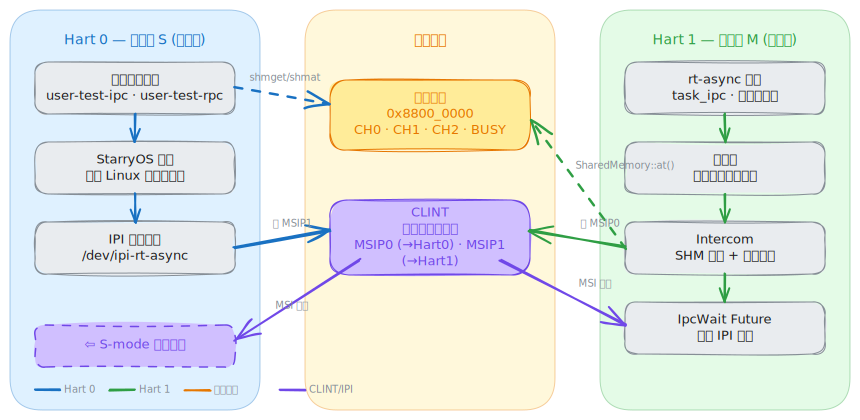

# rt-async-amp —— 异构多核实时双内核 AMP 系统

> **全国大学生计算机系统能力大赛 · OS功能挑战赛道（2026）proj53 异步操作系统**
> 团队编号：T2026104169910100

在异构多核平台上构建 **StarryOS（通用）+ rt-async（实时）双内核** 系统：通用大核跑 Linux 兼容内核处理 AI 推理与复杂计算，实时小核跑自研 Rust async RTOS 处理电机/传感器等微秒级实时任务，两核通过共享内存 + 核间中断（IPI）低延迟协作，互不干扰。

- **文档网站**：<https://rtos.oveln.icu>　·　**开发周报**：<https://rtos.oveln.icu/周报-Oveln/>
- **技术报告**：<https://rtos.oveln.icu/技术报告/>　·　**项目计划**：<https://rtos.oveln.icu/项目计划/>
- **rt-async 内核**：<https://github.com/Oveln/rt-async>　·　**StarryOS**：<https://github.com/Oveln/StarryOS>
- **演示视频**: <https://wwbcs.lanzoub.com/ider63tqxjcd 密码:bxh3>

---

## 目录

- [一、目标描述](#一目标描述)
- [二、比赛题目分析和相关资料调研](#二比赛题目分析和相关资料调研)
- [三、系统框架设计](#三系统框架设计)
- [四、开发计划](#四开发计划)
- [五、比赛过程中的重要进展](#五比赛过程中的重要进展)
- [六、系统测试情况](#六系统测试情况)
- [七、遇到的主要问题和解决方法](#七遇到的主要问题和解决方法)
- [八、提交仓库目录和文件描述](#八提交仓库目录和文件描述)
- [附录：快速开始与构建](#附录快速开始与构建)

---

## 一、目标描述

### 1.1 要解决的问题

机器人、具身智能等新一代智能装备同时存在两类截然不同的计算需求：

- **通用计算 / AI 推理**：视觉识别、路径规划、大模型推理，需要丰富生态（Linux、文件系统、网络、AI 框架），但对延迟不敏感；
- **硬实时控制**：电机 PWM、IMU 采样、闭环 PID，要求**微秒级确定性**，受不得调度抖动与 GC 影响。

把这两类负载塞进同一个 系统内核，实时性会被调度器、缓存、中断合并层层削弱；而纯 RTOS 又缺乏通用计算与 AI 生态。**单一内核无法同时兼顾"生态丰富"与"实时确定性"。**

### 1.2 项目目标

构建一套基于Rust的**异步异构多核双内核 AMP（非对称多处理）系统**，用物理隔离彻底解决上述矛盾：

1. **实时内核 rt-async**：基于 Rust 的 `#![no_std]` async RTOS，优先级抢占 + 共享系统栈 + O(1) 调度，零额外栈切换开销；
2. **通用内核 StarryOS**：承载 AI 推理与用户态应用；
3. **跨核通信框架** `ov-channels`（共享内存无锁通道）+ `ov-rpc`（postcard 序列化 RPC），辅以 IPI 通知，实现两核低延迟协作；
4. **qemu与真实硬件**：从 QEMU virt 仿真验证，移植到 **进迭时空 K3 SoC 的 RT24 实时小核**，并设计对比实验量化"实时核"的价值。

### 1.3 核心价值

| 维度 | 单内核（Linux）方案 | 本项目双内核方案 |
|------|---------------------|------------------|
| 实时确定性 | 受调度/缓存/GC 影响，抖动大 | **物理隔离，大核负载不影响小核** |
| 跨核通信延迟 | — | IPI + 共享内存，**微秒级** |
| 内核语言 | C | **Rust async** |

---

## 二、比赛题目分析和相关资料调研

### 2.1 赛题分析与本题定位

#### 赛题背景

本项目对应设计赛道 **proj53「异步操作系统」**。操作系统通过对系统调用请求、代码执行异常和外部设备中断等事件的响应机制来实现对软硬件资源的管理与访问协调，而**事件触发时间的不确定性**会在内核服务中引入大量等待时间，严重影响资源利用效率与响应延迟。**Rust 语言的异步编程机制**为并发与并行任务的执行控制和资源访问协调提供了优雅的解法——异步操作系统试图把 Rust 异步引入操作系统内核，以简化内核中并发任务的控制与协调，并提升高并发场景下的资源利用率。

赛题特别聚焦**任务调度**这一核心机制：它不仅直接分配 CPU 时间，还与中断机制紧密协作、相辅相成。不同场景对调度提出不同要求——云场景追求高吞吐与低延迟（高效分发、动态调整、快速响应、考虑局部性）；**嵌入式场景则呈现实时性与非实时性混合需求**：既要保证实时任务在规定时间内完成、具有确定性响应时间，又要合理安排非实时任务以提升资源利用率，甚至兼顾设备能耗。

### 2.2 现有方案调研

#### 实时内核

| 方案 | 特点 | 与本项目的关系 |
|------|------|----------------|
| FreeRTOS / RT-Thread | C 实现，成熟生态 | 传统任务模型，逐任务分配栈 |
| Zephyr | 高度可配置 RTOS | 生态偏 MCU |
| embassy | Rust async 执行器 | **协程高效但无抢占、无优先级**——本项目参考对象 |
| uC/OS-II | 经典抢占式 RTOS | 借鉴其优先级抢占与任务切换思想 |

#### embassy 的不足与本项目的"折衷"

embassy 用 Rust 协程极大提升了栈利用率，但**协程之间无法抢占、缺乏优先级裁决**，多任务场景下实时性差。而传统 RTOS（uC/OS-II）每个任务独占私有栈，主动让权时栈空间浪费。本项目在二者之间折衷：

- 混合调度：**跨优先级抢占 + 同优先级协程协作**；
- 共享系统栈：所有 executor 共用一个栈，主动让权时栈复用，被抢占时在当前栈上嵌套压栈——既保实时性，又近乎零额外栈开销。

#### 异构 AMP / 跨核通信

- **OpenAMP / RPMsg**：Linux 侧成熟的 remoteproc/RPMsg 框架，但依赖较重、与 Linux 内核强耦合；
- **本项目的选择**：因为目标主系统是StarryOS，所以使用自己编写的 `ov-channels` + `ov-rpc`，**不依赖 RPMsg/OpenAMP**，rt-async 侧纯裸机即可收发，主核继续跑 StarryOS。详见 [IPC 设计文档](docs/IPC-DESIGN.md)。

### 2.3 目标硬件调研：进迭时空 K3

K3 采用大小核 + 实时核的异构设计：

| 核 | 类型 | 数量 | 职责 |
|----|------|------|------|
| X100 | 通用大核（RV64GV，乱序 2.4GHz） | 8 | 跑 StarryOS / Linux |
| A100 | AI 核 | 8 | 60 TOPS，能运行 30B 模型 |
| **RT24** | **实时小核（CVA6，RV64GC，顺序 6 级，614.4MHz）** | **2** | **使用rcpu1跑 rt-async 实时任务** |

主要参考资源：

- [K3 User Manual（PDF）](https://cdn-resource.spacemit.com/file/chip/K3/k3_um_en.pdf)
- [esos 官方 RT24 固件（RT-Thread 4.0.4）](https://github.com/spacemit-com/esos)
- [K3 U-Boot（uboot-2022.10, tag k3-br-v1.0.0）](https://github.com/spacemit-com/uboot-2022.10)
- RISC-V AIA / ACLINT / APLIC 规范；[CVA6 开源核心](https://github.com/openhwgroup/cva6)

---

## 三、系统框架设计

### 3.1 总体架构

当前系统运行在 QEMU virt RISC-V 平台上（对于k3会有另外相应的适配），两个硬件线程（hart）各自运行不同的软件栈：

- **Hart 0** 运行完整操作系统 **StarryOS**（Linux 系统调用、文件系统、用户进程）；
- **Hart 1** 运行裸金属异步执行器 **rt-async**，具有确定性实时调度能力，**无操作系统**；
- 两者**仅通过共享内存通道**交换数据，通过 **IPI（核间中断）** 互相通知。



> 📐 **完整架构文档** 见 [`docs/architecture.html`](docs/architecture.html)，下文各小节亦会引用其中对应图示。

### 3.2 QEMU virt 验证平台（当前已跑通）

双核 AMP，OpenSBI 完成异构分流：

```
QEMU virt (-smp 2 -m 256M)
├─ hart 0: OpenSBI → sret S-mode → StarryOS @ 0x80200000  (UART0 @ 0x10000000)
└─ hart 1: OpenSBI → mret M-mode → rt-async @ 0x82800000  (UART1 @ 0x10002000)

共享内存 IPC @ 0x88000000 (ov-channels, ~68KB)
```

- **OpenSBI 补丁**（`patches/opensbi-amp.patch`）：hart 1 直接 mret 到 rt-async（M-mode）、默认下一地址指向 StarryOS、禁 PIE、IPI 转发（直写 MSIP → SSIP）、允许 S-mode 写 CLINT MSIP；
- **QEMU 补丁**（`patches/qemu-uart1.patch`）：在 `0x10002000` 增加第二路 NS16550A UART（IRQ 12）供 rt-async 独立输出。

### 3.3 rt-async 实时内核设计

核心是 **"executor = 线程" + 共享系统栈** 的混合调度模型（详见[技术文档](https://rtos.oveln.icu/docs/)）：

- **优先级抢占**：每个 executor 绑定固定优先级，高优先级抢占低优先级，直接在共享栈上**嵌套压栈**运行（如同嵌套函数调用），完成后栈帧自然归还——**零额外栈切换开销，不经汇编上下文切换**；
- **同优先级协作**：同 executor 内任务通过 `.await` 让权，FIFO 执行；
- **O(1) 调度**：两级位图 `PriorityBitmap<G>`（G∈[1,64]，最多 4096 个优先级），`trailing_zeros()` 常数时间定位最高优先级就绪 executor；
- **Pend ISR 调度循环**：抢占由软中断触发，`run()` 期间开中断允许更高优先级继续嵌套抢占；
- **声明式 API**：`#[task]`、`#[main]`、`#[interrupt]` 过程宏自动生成 ISR 与调度器接线；
- **任务数量无上限**：栈由 executor 调用链自然分配，不逐 task 分配栈。

> 执行器内部流程与任务状态机图见 [`architecture.html` §6 执行器](docs/architecture.html#executor)。

### 3.4 跨核 IPC 通信设计

```
StarryOS → rt-async:  SBI ecall / 直写 → OpenSBI → CLINT MSIP hart 1 → MachineSoft ISR
rt-async → StarryOS:  CLINT MSIP0 → OpenSBI → SSIP → S-mode SWI handler
```

- **数据通路**：`ov-channels` 共享内存无锁 SPSC 环形缓冲（CH0 请求 / CH1 响应 / CH2 急停），每通道 128 条 × 256B；
- **RPC 框架**：`ov-rpc` 支持 `call`（请求-响应）/ `call_poll`（高频 busy-poll）/ `send`（单向推送）/ `urgent`（急停，走 CH2 高优先级通道）四种调用模式；
- **用户态接口**：StarryOS 侧 `/dev/rt_shm` 字符设备，`open → mmap → ioctl(NOTIFY/AWAIT)`，对应用透明。

完整设计见 [docs/IPC-DESIGN.md](docs/IPC-DESIGN.md)；端到端通讯流程、SHM/通道状态机与 RPC 协议图见 [`architecture.html`](docs/architecture.html)（[§3 通讯全流程](docs/architecture.html#flow)、[§4 SHM 与通道状态机](docs/architecture.html#shm)、[§5 RPC 协议](docs/architecture.html#rpc)）。

### 3.5 K3 实体板架构（已跑通）

迁移到 K3 时**整个通信方案不变**，仅底层寄存器地址与外设模型替换。K3 线已在新 driver model（`Board` + 设备树 probe）下跑通抢占调度：

| 层次 | QEMU virt | K3 RT24（rcpu1） |
|------|-------------------|----------------|
| 数据通路 / RPC / 用户态接口 | ov-channels / ov-rpc / `/dev/rt_shm` | **完全不变** |
| IPI 通知 | CLINT MSIP | SysTimer MSIP（`systimer + hart<<27`，上板实测） |
| 定时器 | CLINT mtime/mtimecmp | SysTimer mtime（`base+0xbff8` 全局）/ mtimecmp（`win+0x4000`） |
| 中断控制器 | PLIC `0x0c000000` | PLIC `0xe0000000`（自定义布局：priority/enable/threshold 全带 `hart<<27` 偏移） |
| UART | NS16550A（stride=1） | R_UART0（PXA-UART `0xc0881000`，stride=4，需 UUE+MCR OUT2） |
| 共享内存 | QEMU 物理内存固定区 | SRAM（512KB）或 DDR |
| 启动 | OpenSBI mret 分流 | U-Boot SPL `rproc_load` + `rproc_start`（无 DTB handoff，DTB 内嵌进 ELF） |
| 板级接入 | `default_drivers()`（ns16550a / CLINT） | 自定义 `K3_DRIVERS`（pxa-uart / SysTimer / PLIC），DTB 经 `include_bytes!` 内嵌 |

K3 的 SysTimer 实为 CLINT 风格的**非标准布局**：per-hart 窗口步长 `hart<<27`（而非 SiFive 的 `hart*8`），MSIP 地址经 `firmware/msip_probe/` 上板实测确定为 `0xec000000`（= `systimer + (rcpu1<<27)`）。

---

## 四、开发计划

> 完整计划见[项目计划](https://rtos.oveln.icu/项目计划/)，核心原则：**每个功能完成后立即补充对应测试，不做集中测试阶段。**

### 阶段一：RTOS 内核完善（5 月 12 日 – 6 月 15 日）✅

- [x] 核心调度器（Spawner / Executor / RunQueue）
- [x] O(1) 两级优先级位图 `PriorityBitmap`
- [x] 过程宏 `#[task]` / `#[main]` / `#[interrupt]`
- [x] 平台抽象（`Board` trait + Driver Model，设备树 probe 实例化）、QEMU virt 平台实现
- [x] Timer / TimerQueue、`JoinHandle<T>`
- [x] 集成测试（14 个）

### 阶段二：双内核通信（6 月 1 日 – 6 月 30 日）✅

- [x] `ov-channels` 共享内存通信（Notification + Message Queue）
- [x] `ov-rpc` 调用框架（call / call_poll / send / urgent）
- [x] `amp.toml` 统一配置（地址自动生成）
- [x] StarryOS `rt_shm` 设备驱动
- [x] OpenSBI / QEMU 补丁，QEMU 双核 AMP 跑通

### 阶段三：K3 实体板移植与驱动（6 月 15 日 – 7 月 31 日）🚧

- [x] K3 RT24 启动机制全链路调研
- [x] 实体板上手、刷机、RT24 UART 输出点亮
- [x] 极简 Rust 固件替换官方 ESOS，打通 SPL → RT24 加载链
- [x] `chip-k3-rt24` 模块迁移到 driver model：PXA-UART / SysTimer（Timer+MSIP）/ PLIC，DTB 内嵌
- [x] 抢占调度全链路在 K3 真板跑通（sched_demo：SysTimer 唤醒 + 优先级抢占 + MSIP 自中断）
- [ ] 外设驱动：GPIO / PWM / I2C / SPI（机器人控制所需）

### 阶段四：实验展示（7 月 15 日 – 8 月 10 日）

通过**对比实验**量化实时核价值（详见[项目计划-20260528](https://rtos.oveln.icu/项目计划/项目计划-20260528)）：

1. **控制周期确定性**：StarryOS `timerfd` 1ms vs rt-async 定时器 1ms，对比抖动直方图；
2. **负载下实时性退化**：大核跑 stress-ng / AI 推理时，小核控制周期抖动是否依旧稳定；
3. **IPC 延迟与吞吐**：`call` / `urgent` 往返延迟分布与 P99；
4. **跨核设备操控**：StarryOS 经 ov-rpc 远程读写 RT24 的 UART / I2C（AT24C02），端到端验证全链路。

### 阶段五：决赛交付与答辩（8 月 10 日 – 8 月 12 日）

- K3 板上稳定运行：X100（StarryOS）+ RT24（rt-async 实时）；
- 实时性指标：抢占延迟、IPC 往返延迟、控制周期抖动、负载下退化程度；

---

## 五、比赛过程中的重要进展

> 完整记录见[开发周报](https://rtos.oveln.icu/周报-Oveln/)与[技术报告](https://rtos.oveln.icu/技术报告/)。

| 时间 | 成果 |
|------|--------|
| 2025-11 | 从前身 [embassy_preempt](https://github.com/oveln/embassy_preempt) 出发，启动内核模块化重构，确立跨平台 HAL 设计，将其从stm32芯片解耦，能够在riscv平台运行 |
| 2026-04 | rt-async 内核重新设计：优先级抢占 + 共享系统栈 + O(1) 位图调度，过程宏 API，QEMU virt 平台 |
| 2026-05 | 同步原语、`JoinHandle`；确定 StarryOS + rt-async 双内核架构方案 |
| 2026-06 | **QEMU 双核 AMP 跑通**：ov-channels + ov-rpc + rt_shm 驱动； |
| 2026-07 | **K3 RT24 真板跑通**：driver model 重构（Board + 设备树 probe），MSIP 地址上板实测，sched_demo 跑通抢占调度 + SysTimer + MSIP 全链路 |

---

## 六、系统测试情况

### 6.1 rt-async 内核（QEMU 集成测试）

14 个集成测试位于 `rt-async/apps/test/src/bin/`，以独立 bin 在 QEMU（`riscv64imac-unknown-none-elf` + `qemu-virt` feature）上执行，每个测试输出 `PASS`/`FAIL`。在 `rt-async/` 子模块目录下运行：

```bash
# 单个测试（.cargo/config.toml 已配置 qemu-system-riscv64 为 runner）
cargo run --bin preempt_spawn --features qemu-virt --target riscv64imac-unknown-none-elf -p test

# 在rt-async文件夹内，全部测试：rt-async 自带的 Makefile 便捷封装（make test / make test.<bin>）
make test
```

### 6.2 跨核通信库

| 组件 | 测试数 | 覆盖 |
|------|--------|------|
| `ov-channels` | 33 | `std` + `flags` feature 组合，环形缓冲正确性、容量边界、中断上下文收发 |
| `ov-rpc` | 35 | call / send / urgent 各模式、多通道、序列化往返 |

### 6.3 端到端 AMP 测试（StarryOS 用户态）

`user-apps/` 下三个交叉编译的 Linux 用户态程序，经 `/dev/rt_shm` 驱动与 rt-async 完成真实 RPC 往返：

- `user-test-ipc` —— 基础 IPC（Notification + Message Queue）握手与收发；
- `user-test-rpc` —— RPC 四种调用模式正确性；
- `user-test-sched` —— **三明治计时**：测量 StarryOS 发请求 → IPI → rt-async 处理 → IPI → StarryOS 收响应的端到端延迟（也是发现并修复 IPC 死锁的用例）。

构建与部署均经 xtask：`cargo xtask build user-test-ipc|user-test-rpc|user-test-sched` 编译，`cargo xtask install --all` 装入 StarryOS rootfs，`cargo xtask run` 启动后在 StarryOS 用户态执行。

### 6.4 硬件测试（K3 RT24）

- **msip_probe**（`firmware/msip_probe/`）：一次性诊断固件，上板实测确定 RT24 的 MSIP 地址为 `0xec000000`（= SysTimer `0xe4000000` + `(rcpu1<<27)`），写 1 触发 MachineSoft（mip=0x8）。
- **sched_demo**（`apps/rt-async-k3/src/bin/sched_demo.rs`）：K3 RT24 真板抢占调度验证。task_high（优先级 3）与 task_low（优先级 1）各每 50ms 输出 `H`/`L`，上板观察到稳定交替（H 出现频率 ≥ L）、计数对等上涨，证明 SysTimer 唤醒 + 优先级抢占 + MSIP 自中断全链路在 K3 真板跑通。

构建：`cargo xtask build k3-sched-demo` → `build/rt-async-k3-sched-demo.elf`；刷写：`./scripts/flash/k3-flash.sh`（一键编译+打包 itb+fastboot 刷写）；串口观察：R_UART0，115200 8N1。

---

## 七、遇到的主要问题和解决方法

### 7.1 AMP IPC 死锁：`spin::Mutex` 不关中断

**现象**：`user-test-sched` 三明治计时中，StarryOS 侧 `ioctl(AWAIT)` 永久阻塞，仅在完整 RPC 流程（DELAY + ECHO 连续调用）出现，单步调用正常。

**根因**：`PollSet` 用 `spin::Mutex`（裸自旋锁，**不关中断**）保护 waker 队列。Task 持锁注册 waker 时，同一 hart 的 IPI 中断到达，中断 handler 调 `wake()` 请求同一把锁——**中断 handler 等待被中断的代码释放锁，锁永不被释放**。连续 RPC 使 IPI 频率翻倍，竞争窗口显著增大。

**解决**（详见[AMP 死锁排查技术报告](https://rtos.oveln.icu/技术报告/2026-06-03-AMP死锁排查)）：

1. 用 `kspin::SpinNoIrq`（`lock()` 自动关中断、`drop` 恢复）替换 `PollSet`，把"关中断"编码进类型系统，无法遗漏；
2. **移除中间标志 `IPC_PENDING`**，改为直接读 CH1 环形缓冲 `read/write` 原子变量判定消息可用性——环形缓冲成为唯一真相源，`spurious wakeup` 天然安全。

**经验**：① 中断上下文共享的锁必须关中断——`spin::Mutex` 的 API 与 `std::sync::Mutex` 一模一样，bare metal 下"锁"多一个 IRQ 安全维度，极易被忽略；② 消除冗余中间状态，减少不一致的出错面积；③ 类型系统是防并发 bug 的最好工具。

### 7.2 OpenSBI / QEMU 异构分流与第二路 UART

QEMU virt 默认只有一路 UART、OpenSBI 把所有 hart 都引向 S-mode 下一地址。通过两份补丁解决：

- **OpenSBI**：hart 1 直接 mret 到 rt-async（M-mode）而非 S-mode、IPI 转发、允许 S-mode 写 CLINT MSIP；
- **QEMU**：新增第二路 NS16550A UART（`0x10002000`，IRQ 12）供 rt-async 独立输出，避免双核抢同一串口。

### 7.3 K3 RT24 UART 输入乱码（疑似硬件）

**现象**：K3 实体板上 RT24 经 R_UART0 的**输出完全正常**，但主机下发的**输入字符乱码**，且乱码模式随主机端 USB 转串口芯片变化（如 `abcd`→`aabbccdd` 的字符翻倍，指向 RX 采样率不符）。

**排查**：换回官方 ESOS 固件**复现同样乱码**（排除自写固件 bug）；主核 UART0 完全正常（隔离到 RT24 RX 通路）；换多台电脑/多块串口硬件现象一致。结论：**疑似 RT24 RX 引脚 pinctrl 配置（驱动强度/上下拉）或硬件本身问题**。

**当前处理**：输出方向不受影响，暂以"仅输出"方式继续调试（与过往调试方式一致），已购新 CH340 芯片待对照。

---

## 八、提交仓库目录和文件描述

本仓库（`rt-async-amp`）为大赛提交主仓库，整合双内核、通信框架、用户态测试与构建系统。两个内核分别以独立 GitHub 仓库作为 submodule 引入。

```
rt-async-amp/
├── rt-async/                     # 【submodule】rt-async 实时 RTOS 内核 (github.com/Oveln/rt-async)
│   ├── modules/executor/         #   核心调度器：Spawner / Executor / PriorityBitmap / task
│   ├── modules/executor-macro/   #   过程宏 #[task] #[main] #[interrupt]
│   ├── modules/platform*/        #   Board trait + Driver Model（设备树 probe）+ 平台实现
│   └── apps/test/                #   14 个 QEMU 集成测试
├── tgoskits/                     # 【submodule】集成构建框架（含 os/StarryOS 通用内核、os/arceos、os/axvisor）
│   └── os/StarryOS/              #   StarryOS 通用内核（本项目在其 kernel/src/pseudofs/dev/rt_shm.rs 新增 IPC 设备）
├── apps/
│   ├── rt-async-app/             # rt-async 侧应用（QEMU virt）
│   │   └── src/                  #   intercom.rs(IPI 策略) ipc_wait.rs uart_wait.rs bin/(console/demo)
│   └── rt-async-k3/              # rt-async 侧应用（K3 RT24，sched_demo 抢占调度验证）
├── user-apps/                    # StarryOS 用户态测试程序（musl 交叉编译）
│   ├── user-test-ipc/            #   基础 IPC 收发
│   ├── user-test-rpc/            #   RPC 四种调用模式
│   └── user-test-sched/          #   三明治计时（端到端延迟 / 死锁复现用例）
├── modules/
│   ├── chip-qemu-virt-rt/        # QEMU virt 平台支持（UART1 / CLINT / IPI / PLIC）
│   ├── chip-k3-rt24/             # K3 RT24 平台支持（PXA-UART / SysTimer / MSIP / PLIC，DTB 内嵌）
│   └── ov-rpc/                   # RPC 框架（postcard 序列化，call/send/urgent）
├── patches/
│   ├── opensbi-amp.patch         # OpenSBI：hart 路由 + PIE 修复 + IPI 转发
│   └── qemu-uart1.patch          # QEMU：第二路 UART @ 0x10002000 (IRQ 12)
├── its/                          # 设备树源 + 编译产物（内嵌进 ELF .rodata）
│   ├── rt-async-k3.dts/.dtb      #   K3 RT24 rcpu1 设备树（U-Boot 不 handoff DTB）
│   └── qemu-virt-amp.dts         #   QEMU virt AMP 设备树
├── firmware/
│   └── msip_probe/               # 一次性诊断固件：上板实测 RT24 MSIP 地址
├── scripts/flash/                # K3 一键刷写（编译+打包 itb+fastboot）
├── xtask/                        # 【构建编排器】setup/build/run/install/clean/qemu 子命令
├── docs/
│   ├── architecture.html         # 交互式架构文档（7 节图表，README §3 引用）
│   └── assets/                   # 架构图 SVG / excalidraw 源文件
├── amp.toml                      # 地址布局/构建参数/仓库 pin 的单一真相源
├── Cargo.toml                    # workspace 定义（ov-channels v0.2.0 等依赖）
└── README.md                     # 本文件
```

**约定**：`amp.toml` 是所有地址常量的单一真相源，patch 文件中的 `{VAR}` 模板变量在 `cargo xtask setup` 时由其顶层取值替换，避免多处硬编码不一致。

---

## 附录：快速开始与构建

本项目使用 [`cargo xtask`](xtask/) 作为构建编排器（取代 Makefile），所有克隆/打补丁、构建、运行、安装、清理均通过 xtask 子命令完成。子命令一览可用 `cargo xtask --help` 查看。

### 前置依赖

- **Rust 工具链**：`rustup`（安装见 [rustup.rs](https://rustup.rs)）+ `rustup target add riscv64imac-unknown-none-elf`
- `riscv64-elf-gcc`（Homebrew：`brew install riscv64-elf-gcc`）
- **Musl 工具链**：交叉编译 `user-apps` 所需（StarryOS 用），安装见下方
- Ninja / Meson（构建定制 QEMU：`brew install ninja meson`）、Python 3

#### 安装 Musl 工具链

参照 [StarryOS](https://github.com/Starry-OS/StarryOS) 的做法，使用预编译包（而非手动 `musl cross-make`）：

1. 从 [setup-musl releases](https://github.com/arceos-org/setup-musl/releases/tag/prebuilt) 下载 `riscv64-linux-musl-cross`；
2. 解压到某路径，例如 `/opt/riscv64-linux-musl-cross`；
3. 将 `bin` 目录加入 `PATH`，例如：

   ```bash
   export PATH=/opt/riscv64-linux-musl-cross/bin:$PATH
   ```

安装后即可获得 `riscv64-linux-musl-gcc` / `riscv64-linux-musl-objcopy` 等工具。

### 一键构建运行

```bash
git submodule update --init --recursive   # 1. 初始化子模块
cargo xtask setup                          # 2. 克隆 + 打补丁 OpenSBI 与 QEMU
cargo xtask qemu                           # 3. 构建运行环境qemu
cargo xtask build                          # 4. 构建全部组件（等同 build all）
cd StarryOS && make rootfs && cd ..       # 5. 下载并准备 StarryOS rootfs 镜像
cargo xtask install --all                # 6. 将 user-apps 安装进 StarryOS rootfs
cargo xtask run                            # 7. 启动双核 AMP（可选 --tmux 同时观察 UART1）
```

### K3 实体板构建与刷写

```bash
cargo xtask build k3-sched-demo            # 构建 K3 RT24 rcpu1 固件 → build/rt-async-k3-sched-demo.elf
./scripts/flash/k3-flash.sh                # 一键：编译 + 打包 itb（rcpu0 esos + rcpu1 rt-async）+ fastboot 刷写
# 串口观察 R_UART0（115200 8N1）：sched_demo 输出交替的 H/L
```

> K3 的 rcpu0 跑固定复用的官方 esos，rcpu1 跑本仓库构建的 rt-async；两者由 U-Boot 从同一 itb 的不同节点加载（无 DTB handoff，DTB 内嵌进 ELF）。详见 [`scripts/flash/README.md`](scripts/flash/README.md)。

### 常用子命令

```bash
# 构建单个目标：组件（opensbi / starryos / user-test-*）或 rt-async bin
cargo xtask build <target>   #   rt-async bin 用 <平台>-<bin> 命名：
                             #     qemu-demo / qemu-console / qemu-console-interrupt → flat bin（QEMU loader）
                             #     k3-sched-demo → ELF（esos 脚本整合进 itb）
cargo xtask build qemu       # 构建全部 QEMU rt-async bin
cargo xtask build k3         # 构建全部 K3 rt-async bin
cargo xtask run --bin demo   # 指定 rt-async bin 启动（默认 demo；run 用短名）
cargo xtask log              # 彩色前缀跟踪 rt-async 的 UART1 日志
cargo xtask install --all    # 将 user-apps 安装进 StarryOS rootfs
cargo xtask qemu             # 从源码构建带 UART1 的定制 QEMU
cargo xtask clean --dist     # 清理构建产物（--dist 连带删除 opensbi/ 与 qemu/）
cargo xtask completions fish # 生成 shell 补全脚本（bash/zsh/fish/...）
```

### 说明

- Musl 工具链（提供 `riscv64-linux-musl-gcc` / `riscv64-linux-musl-objcopy` 等）：从 [setup-musl](https://github.com/arceos-org/setup-musl/releases/tag/prebuilt) 预编译包安装，详见上方「安装 Musl 工具链」；
- `amp.toml` 是所有地址常量的单一真相源，xtask 读取它驱动地址/layout 生成与 patch 模板渲染。
