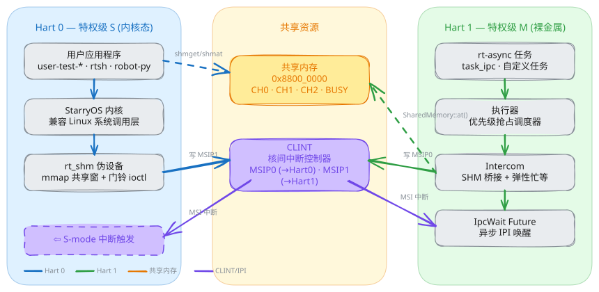

# rt-async-amp —— 异构多核实时双内核 AMP 系统

在异构多核平台上构建 **StarryOS（通用）+ rt-async（实时）双内核** 系统：通用大核跑 Linux 兼容内核处理 AI 推理与复杂计算，实时小核跑自研 Rust async RTOS 处理电机/传感器等微秒级实时任务，两核通过共享内存 + 核间中断（IPI）低延迟协作，互不干扰。

- **文档网站**：<https://rtos.oveln.icu>　·　**开发周报**：<https://rtos.oveln.icu/周报-Oveln/>
- **技术报告**：<https://rtos.oveln.icu/技术报告/>　·　**项目计划**：<https://rtos.oveln.icu/项目计划/>
- **rt-async 内核**：<https://github.com/Oveln/rt-async>　·　**StarryOS**：<https://github.com/Oveln/StarryOS>

> 技术调研、开发计划与里程碑、测试记录、问题复盘等详细内容在上述文档网站（blogs）中维护，本 README 只保留简介、架构与使用方法。

---

## 简介

机器人、具身智能等新一代智能装备同时需要两类截然不同的计算能力：Linux 生态的通用算力（AI 推理、网络、文件系统）与微秒级确定性实时（电机控制、传感器采样）。单一 Linux（即使 PREEMPT_RT）难以同时满足，本项目的答案是**异构双内核 AMP**：

- **StarryOS**（大核，S 态）：Linux 系统调用兼容内核，承接通用负载；
- **rt-async**（小核，M 态）：自研 Rust async RTOS——无动态内存、async/await 任务模型、优先级抢占 + 时间片调度，承接实时负载；
- 两核**只经共享内存通道（ov-channels）+ IPI 门铃**协作，实时侧不受通用侧抖动影响。

三个运行环境同构管理（`envs/<name>.toml`，详见使用方法）：

| 环境 | 硬件 | 定位 |
|---|---|---|
| `qemu-plic` | QEMU virt 双核（PLIC） | 日常快速冒烟，秒级迭代 |
| `qemu-aia` | QEMU virt 双核（APLIC+IMSIC） | K3 AP 侧中断架构的仿真对应物（当前仅 AP 侧可跑） |
| `k3-com260` | 进迭时空 K3 COM260（X100 + RT24 rcpu1） | 真板：实时硬件操控落地 |

## 架构

两个硬件线程（hart）各自运行不同的软件栈，**仅通过共享内存交换数据、通过 IPI 互相通知**：

- **Hart 0** 运行完整操作系统 **StarryOS**（Linux 系统调用、文件系统、用户进程）；
- **Hart 1** 运行裸金属异步执行器 **rt-async**，具有确定性实时调度能力，**无操作系统**。



QEMU virt 环境双核 AMP，OpenSBI 完成异构分流：

```
QEMU virt (-smp 2 -m 256M)
├─ hart 0: OpenSBI → sret S-mode → StarryOS @ 0x80200000  (UART0 @ 0x10000000)
└─ hart 1: OpenSBI → mret M-mode → rt-async @ 0x82800000  (UART1 @ 0x10002000)

共享内存 IPC @ 0x88000000 (ov-channels SharedMemory<3>, 100KB)
```

- **OpenSBI 补丁**（`patches/opensbi-amp.patch`）：hart 1 直接 mret 到 rt-async（M-mode）、默认下一地址指向 StarryOS、禁 PIE、IPI 转发（直写 MSIP → SSIP）、允许 S-mode 写 CLINT MSIP；
- **QEMU 补丁**（`patches/qemu-uart1.patch`）：在 `0x10002000` 增加第二路 NS16550A UART（IRQ 12）供 rt-async 独立输出。

K3 真板环境：AP 侧 X100 大核跑 StarryOS（APLIC+IMSIC 中断架构，经 FIT uimg 启动），RP 侧 RT24 rcpu1（CVA6）跑 rt-async（SPL 从 esos.itb 拉起，RCPU SRAM 共享窗 + mailbox4 门铃）。

📐 **完整架构文档**（executor 流程、任务状态机、RPC 模式、shm 结构、内存布局、模块依赖等 7 节交互式图表）见 [`docs/architecture.html`](docs/architecture.html)。

## 使用方法

本项目使用 [`cargo xtask`](xtask/) 作为构建编排器（取代 Makefile），所有克隆/打补丁、构建、运行、安装、清理均通过 xtask 子命令完成，子命令一览用 `cargo xtask --help` 查看。

### 环境模型

**环境（environment）是一等公民**：`envs/<name>.toml` 声明该环境的 QEMU 机器参数、StarryOS 板级配置（tgoskits 内路径）、AP 侧 DTB 来源与 K3 打包 bin。产物按环境隔离在 `build/<env>/` 下，互不干扰。

| 环境 | 构建命令 | 运行/刷写 | `build/<env>/` 产物 |
|---|---|---|---|
| `qemu-plic` | `cargo xtask build qemu-plic` | `cargo xtask run`（默认环境） | `fw_dynamic.bin` / `starryos.bin` / `rt-async*.bin` / `ap.dtb` / `rt-async.dtb`（dtb 首次 run 时自动生成） |
| `qemu-aia` | `cargo xtask build qemu-aia` | `cargo xtask run --env qemu-aia`（**仅 AP 侧完整**，见下） | 同上（`ap.dtb` 由 dumpdtb+overlay 自动生成） |
| `k3-com260` | `cargo xtask build k3-com260` | 手动 U-Boot fastboot 序列（opensbi/RP/AP 各一套，见下文 K3 小节） | `opensbi.itb`（M 态）/ `esos.itb`（RP 侧）/ `starryos.uimg`（AP 侧）/ `rt-async-k3-*.elf` |

> user-apps 与环境无关，产物留在 `build/` 顶层。`amp.toml` 只管 QEMU 运行所需的引导链地址与上游 repo pin；机器参数等环境属性在 `envs/`，共享内存窗口等其余地址布局以设备树为准（运行时双端 DT probe）。

### 前置依赖

- **Rust 工具链**：`rustup`（安装见 [rustup.rs](https://rustup.rs)）+ `rustup target add riscv64imac-unknown-none-elf`
- `riscv64-elf-gcc`（Homebrew：`brew install riscv64-elf-gcc`；Ubuntu：`gcc-riscv64-unknown-elf`）
- **Musl 工具链**：交叉编译 `user-apps` 与 StarryOS 的 C 依赖（lwprintf）所需，安装见下
- Ninja / Meson（构建定制 QEMU：`brew install ninja meson` / `sudo apt install ninja-build meson`）、Python 3
- `cc` + `dtc`（设备树编译链；`sudo apt install device-tree-compiler`）
- 仅 K3 刷写需要：`mkimage` / `lzop` / `fastboot`

#### 安装 Musl 工具链

参照 [StarryOS](https://github.com/Starry-OS/StarryOS) 的做法，使用预编译包（而非手动 `musl cross-make`）：

1. 从 [setup-musl releases](https://github.com/arceos-org/setup-musl/releases/tag/prebuilt) 下载 `riscv64-linux-musl-cross`；
2. 解压到某路径，例如 `/opt/riscv64-linux-musl-cross`；
3. 加入 `PATH`：

   ```bash
   export PATH=/opt/riscv64-linux-musl-cross/bin:$PATH
   # 也可 export RISCV64_MUSL_CROSS=/opt/riscv64-linux-musl-cross（xtask 会自动前置其 bin）
   ```

### 首次搭建（qemu-plic 全链路）

```bash
git submodule update --init --recursive   # 1. 初始化子模块（rt-async / tgoskits）
cargo xtask setup                          # 2. 克隆 + 打补丁 OpenSBI 与 QEMU（amp.toml pin 版本）
cargo xtask qemu                           # 3. 源码构建定制 QEMU（含 rt-async 专用 UART1）
cargo xtask build qemu-plic                # 4. 环境聚合构建（OpenSBI + StarryOS + RP bins + user-apps）
cd tgoskits && cargo xtask starry rootfs --arch riscv64 && cd ..   # 5. 准备 rootfs（tgoskits 正统流程）
cargo xtask install --all                # 6. 将 user-apps 安装进 rootfs
cargo xtask run                            # 7. 启动双核 AMP
```

### 日常开发循环（QEMU 环境）

启动后两路串口的观察方式：

- **UART0 → 本终端 stdin/stdout**：OpenSBI 启动横幅 → StarryOS 启动日志 → `root@starry:/root #` 交互 shell。
- **UART1（rt-async 侧）→ Unix socket** `/tmp/rt-async-uart.sock`，两种接法：
  - `cargo xtask run`（前台）：另开终端 `socat - UNIX-CONNECT:/tmp/rt-async-uart.sock`。注意 QEMU 是 socket 服务端，**连接之前的启动期输出会丢**；
  - `cargo xtask run --tmux`：tmux 左右分屏（左 QEMU、右 UART1），socat 先监听、QEMU 作客户端连接，**不丢启动期输出**（推荐）。

想持续留档 UART1 日志给 `cargo xtask log` 跟踪，把 socat 输出 tee 到约定文件：

```bash
socat - UNIX-CONNECT:/tmp/rt-async-uart.sock | tee build/rt-async-uart.log
```

**正常冒烟标志**：UART0 上 OpenSBI 横幅 + StarryOS shell + `rt_shm: device initialized, phys base 0x88000000`；UART1 上 `[heartbeat] tick #N` 每 500ms 一条（demo bin）。

换 rt-async 固件（run 用 cargo 短名，不带平台前缀）：

```bash
cargo xtask run --bin console              # demo / console / console_interrupt
```

### qemu-aia：AIA 仿真环境（当前仅 AP 侧）

机器参数 `virt,aia=aplic-imsic`，StarryOS 侧 somehal 运行时按 FDT 探测，自动走 IMSIC+APLIC 路径（`OpenSBI: Platform IPI Device : aia-imsic` 即为生效标志）；AP 侧 DTB 由本环境机器 dumpdtb 导出基线、`fdtoverlay` 叠加共享窗节点（`its/rt-async-ap.overlay.dts`），中断拓扑自动正确，无需手写 imsic 节点。

**当前边界（事实状态）**：AIA 是 StarryOS 侧的支持，**rt-async 暂不支持 AIA**（RP 侧只有 PLIC 驱动，而该机器无 PLIC，RP 侧会静默挂死）。因此 `run --env qemu-aia` 目前用于 **AP 侧 AIA 行为验证**（MSI 投递、stopei EOI 等先在仿真确认再到 K3 真板）；等 rt-async 补 APLIC/IMSIC 驱动后启用完整双端。详见 `envs/qemu-aia.toml` 注释。

### K3 真板（k3-com260）

**构建（xtask 职责到产物为止）**：

```bash
cargo xtask build k3-com260
# 交付两个产物：
#   build/k3-com260/esos.itb       RP 侧：rcpu0 握手占位 + rcpu1 rt-async（默认 k3-sched-demo）
#   build/k3-com260/starryos.uimg  AP 侧：StarryOS FIT（kernel + dtb）
```

换打包的 rcpu1 bin（打包脚本保留在 `scripts/flash/k3-pack-itb.sh`）：

```bash
cargo xtask build k3-ipc-demo
ELF_SRC=build/k3-com260/rt-async-k3-ipc-demo.elf bash scripts/flash/k3-pack-itb.sh
```

**刷写/引导（手动，U-Boot 串口 + 主机 fastboot）**

> ⚠️ U-Boot 的 `fastboot` 在 stage 传输完成后**不会自动退出**，必须 **Ctrl+C** 回到提示符才能执行下一条命令。

刷 RP 固件（写入 `esos` MTD 分区，掉电保留）：

```bash
fastboot -l $loadaddr -s 0x100000 usb 0     # U-Boot：进入 fastboot（阻塞命令）
fastboot stage build/k3-com260/esos.itb     # Host：上传 itb
# ↓ U-Boot：Ctrl-C 退出 fastboot 后逐条执行：
mtd erase esos
mtd write esos $loadaddr
reset
```

引导 AP 内核（StarryOS 不落 flash，`bootm` 直接启动；FIT 上传地址 `0x180000000` 与 kernel/fdt 加载地址错开）：

```bash
fastboot -l 0x180000000 -s 0x04000000 usb 0   # U-Boot
fastboot stage build/k3-com260/starryos.uimg  # Host：上传 uimg
# ↓ U-Boot：Ctrl-C 退出 fastboot 后：
bootm 0x180000000
```

刷 OpenSBI（写入 `opensbi` MTD 分区——**PMA 非缓存窗口固件**，K3 共享窗一致性的唯一依赖）：

```bash
fastboot -l $loadaddr -s 0x100000 usb 0     # U-Boot：进入 fastboot（阻塞命令）
fastboot stage build/k3-com260/opensbi.itb  # Host：上传 itb
# ↓ U-Boot：Ctrl-C 退出 fastboot 后逐条执行：
mtd erase opensbi
mtd write opensbi $loadaddr
reset
```

> 该固件 = 官方 spacemit/opensbi（tag k3-br-v1.0.0）+ 两笔补丁：k3_defconfig 开
> CONFIG_ENABLE_LOGGING（启动横幅，banner 列出 ISA 扩展含 svpbmt）、每 hart
> 启动时按界址定位覆盖共享窗（0xc0800000..0xc0880000，本板 boot ROM 表 =
> entry4）的 PMA entry 翻 IO——X100 硅忽略 Svpbmt PTE 位，PMA 是窗口非缓存
> 的唯一途径。启动日志出现 `K3 PMA: AMP window -> entryN IO (was 0x20)` 即
> 生效；验收/回归用 `user-test-pbmt`（十秒判窗：写直达 + 读前进 + 时延
> 数十倍于缓存命中）。刷回官方固件则窗口回到 cacheable——内核与用户态的
> CBO 缓存维护已全部撤除，官方固件下协议**不再可用**（写被缓存吸收）。

> K3 的 rcpu0 跑**本仓库的握手占位固件**（`scripts/flash/payloads/rt24_os0_rcpu.S`：入口写 BOOT_ENTRY 寄存器解锁 AP 的 6s 启动轮询后永久 wfi，不参与 AMP 通信；mailbox3 留给未来），rcpu1 跑本仓库构建的 rt-async；两者由 SPL 从同一 itb（沿用官方 `esos` 分区命名）的不同节点加载，无 DTB handoff（DTB 内嵌进 ELF）。AP 与 RP 是两套独立镜像；bootargs 已固化在设备树 chosen 节点，无需 setenv。

### 用户态应用（user-apps）开发循环

user-apps 是 StarryOS 侧的 musl 静态二进制，两个环境的上板方式不同：

```bash
cargo xtask build user-test-rpc      # 单独构建（环境聚合构建也会带上）
# qemu-plic：注入 rootfs 后在 StarryOS shell 里运行
cargo xtask install --all            # 全部注入（或 install build/user-test-rpc --dst /user-test-rpc）
cargo xtask run                      # shell 里执行 /user-test-rpc
```

k3-com260：板上经**局域网 HTTP 服务器 wget** 拉取——主机在产物目录起服务，板上 wget 后直接执行：

```bash
python3 -m http.server -d build 8000   # Host：在 build/ 目录起 HTTP 服务
# 板上（StarryOS shell，IP 按实际网络填写）：
#   wget http://<host-ip>:8000/user-test-ipc -O /tmp/user-test-ipc
#   chmod +x /tmp/user-test-ipc && /tmp/user-test-ipc
```

#### rt-async 交互式 shell（rtsh）

把 `/dev/rt_shm` 当设备打开（open + mmap + ioctl 门铃）、在共享窗上经
ov-rpc 与 RP 固件交互式对话的 REPL——`rtsh` 无参进入（空行重复上一条，
quit/Ctrl-D 退出），`rtsh <cmd> [args..]` 单发即退。**启动时自动服务发现
一次**并打印固件方法表（mid/形态/名称），命令按方法名解析 mid——固件
侧重编号无需重编 rtsh（参数/返回类型仍编译在各命令内）。命令面：

- **通用 RPC**：`services`（重新服务发现并列方法表，启动时已自动一次）、
  `echo` / `add` / `delay`、`ping [N]`（RTT 分位数 + D1-D4
  发现路径分布，单次含 RP 侧 isr→sched / sched→seen 分段）、`stat`
  插桩计数器表（bench `s0` 的交互版）；
- **机器人语义**：同 robot-ctl 的全部 CLI op（status/init/drive/stop/
  brake/get/arm/torque/grab/release/uwrite/uread）；
- **probe 测量面**：`membench OP [ARG]`、`peek ADDR`（只读寄存器 1000
  连读单价）、`litmus`——仅 probe 固件实现。

配 K3 `k3-robot-ctrl` 固件时全部可用；QEMU `rt-async-app` 固件仅注册
echo/add/delay，其余命令按名字解析失败、立即报错（不再挂到超时）。

```bash
cargo xtask build rtsh        # 产物 build/rtsh（wget 部署同上）
# 板上：
/tmp/rtsh                     # REPL
rtsh> ping 20                 # RTT min/avg/p50/p95/p99/max + 路径分布
rtsh> stat                    # 插桩计数器 dump
rtsh> peek 0xc088c04c         # 只读寄存器探测（probe 固件）
```

#### IPC 延迟基准（user-test-bench）

路径分离的 IPC 延迟/正确性基准，与 RP 固件 intercom 内置插桩（`PING`/`STATS`
服务，`apps/rt-async-k3/src/intercom.rs`）配对：按 RP 察觉请求的四种方式
（D1 睡眠中断唤醒 / D2 弹性自旋命中 / D3 批处理追加 / D4 竞态闭环）分桶测量
RTT 与 RP 内部分段（t_isr/t_sched/t_seen），并做端到端计数器对账（消息零丢失、
路径分桶守恒、回显/rid 校验）。内置看门狗：AWAIT 挂死 10s 内被 SIGALRM 打断，
带诊断退出，无需复位板子。

```bash
cargo xtask build user-test-bench
# RP 侧需跑含插桩的 bin（k3-ipc-demo / k3-shm-ping 均可）：
cargo xtask build k3-ipc-demo
ELF_SRC=build/k3-com260/rt-async-k3-ipc-demo.elf bash scripts/flash/k3-pack-itb.sh

# 板上（wget 部署同上）按序执行：
/tmp/user-test-bench s0                        # 标定：弹性窗口 W + 计数器 dump
/tmp/user-test-bench s1                        # 空闲唤醒路径（校验 100% D1）。默认 interval=2×W（W≈2s → 单轮 ~4s）、n=25 → 全程 ~2min
/tmp/user-test-bench s2                        # 弹性自旋路径（校验 ≥90% D2）
/tmp/user-test-bench s4                        # 竞态扫描：随机间隔 (0,2W)，D4 命中率。默认 n=50（均值 2s/轮）≈ 2min
/tmp/user-test-bench s6                        # 边界流：间隔 W，D1/D2 混合 + 冗余门铃率。默认 n=50 ≈ 2min
BENCH_CSV=/tmp/s1.csv /tmp/user-test-bench s1 300  # 大样本 + CSV 落盘（300 轮 ≈ 20min）
```

用法 `user-test-bench <s0|s1|s2|s4|s6|raw|mb|dd> [iterations] [interval_ns] [warmup=50]`；
退出码 0=全部通过 / 2=看门狗超时 / 3=数据校验失败 / 4=发送背压异常。
逐样本 CSV 经 `# ---- csv begin/end ----` 标记嵌在 stdout（或 `BENCH_CSV` 落盘），
列含 `sysc`（本轮 syscall 数）与 `ddrain/ddisp`（ISR 舞步 / 派发两段）。

**延迟归因诊断（mb / dd / lit 场景，2026-08-17 新增）**：

```bash
/tmp/user-test-bench mb                 # RP 内存/MMIO 微基准（MEMBENCH 服务）
/tmp/user-test-bench dd                 # D1 门铃投递分解（PING 8 戳 + 内核双戳）
/tmp/user-test-bench dd 100             # 100 轮
/tmp/user-test-bench lit                # 跨核免 fence 顺序性实验（LITMUS）
```

> 固件侧探针（MEMBENCH/LITMUS/STATS 扩展列）由 app feature `probe` 门控，
> **默认关闭**（正常开发视角 intercom 只含生产服务）；xtask
> 构建的 K3 板上产物恒带上（RTASYNC_BINS 表条目 `features = ["probe"]`），
> dd/lit/mb 场景直接可用。裸 `cargo build -p rt-async-k3` 得到无探针固件。
> 同理，RP 侧微架构基准 bin `rtbench`（fence/原子/桥单价）由 feature `bench`
> 以 `required-features` 门控，默认不编译，经 `cargo xtask build k3-rtbench`
> 单独构建。K3 bins 另有恒开的 `cs-atomics`（单核原子后端，详见
> `targets/riscv64imac-k3-none-elf.json` 头注与 AGENTS §2）：本地原子
> 经 portable-atomic critical-section 回退（mstatus 屏蔽 ~90ns/笔），
> 共享窗跨核原子保持 core 原生语义。

- `mb`：RP 侧单笔访问单价表——共享窗 vs 本地 .bss 的 8B 读 / 256B 块读
  （= try_recv 消息取读）/ 写+fence / stride 扫描 / mailbox 只读寄存器与
  mtime 的 MMIO 读。检验「无缓存 SRAM ~3.3µs/笔、256B 取读 ~105µs、
  dsched 69.8µs = ISR MMIO 舞步」等归因假设，直接决定优化方向
  （物理下限 vs 别名/瘦身）。
- `dd`：每轮 D1 门铃唤醒，用 PING 回传的 RP mtime 戳（t_isr/t_drain/
  t_sched/t_seen）× 内核双戳（NOTIFY 门铃 MMIO 写前 / mailbox IRQ 入口，
  经 ioctl `RD_KTS` 读出）做交叉分解；svc 探针（handler 服务时长）经
  STATS 锁存读出。钟差无关恒等式给出可作绝对结论的量：`S = X+RP尾+Y`、
  `AP 回程`、闭环残差自检；`X+o` 只看抖动。（原 dseen 三段细分随
  ov-rpc stamps 插桩删除——战役收官，需要时从 git 历史恢复。）
  **前提：starryos.uimg 含内核双戳（RD_KTS ioctl）——需重刷 uimg。**
- `lit`：跨核免 fence 顺序性实验（迁移前测量，2026-08-17）——L1 消费侧
  （AP 顺序发布、RP 按读模式矩阵轮询：纯读/fence 读/邻址读）、L2 生产侧
  （RP 免 fence 发布 + 裸门铃绕过 notify fence、AP 轮询校验）、
  L3 Dekker 对照。每组含正序判据 + 反序对照组（验证检测器有效）。
  判读：L1 fence 读 PASS ⇒ RP 读新鲜度需每读一条 fence（≈Acquire 价，
  邻址读已证无逐出效果）；L2 正序 PASS ⇒ RP 免 fence 写落地保序、
  notify fence 可省；L3 RP stale ⇒ clear_busy 后的 fence 必须保留
  （或换硬件 spinlock）。

#### 机器人控制（robot-ctl + k3-robot-ctrl）

AP 用户态控制 AKA-00 小车（底盘 ESP32-C3 + ZP10S 机械臂）。**协议在 RP 侧**
（`apps/rt-async-k3/src/robot.rs`：tt_pid 二进制帧 + zp10s ASCII，两个 P1
协议任务），AP 侧只发语义 RPC——`robot-ctl`（CLI + serve JSON 行协议，
`user-apps/robot-ctl/robot.py` 供 Python 经 Popen 管道调用，接口对齐
AKA-00 的 `MotorPairProtocol`/`ServoProtocol`）。INIT/GRAB/RELEASE 经 ov-rpc
`acall` 异步完成（handler 转交任务、完成后补响应，AP `recv_for` 无感闭环）。

**接线（2026-08-27 载板原理图 `k3-com260_kit_v02` 定案；09-03 机械臂定案
AP 域 UART5，双通道）**：com260 40 针排针上唯一完整可用的 R.UART 是 **R_UART0 @
GPIO_122/123 → pin29(TX)/pin32(RX)**（网络名 GPIO01/GPIO07 = MMC2_DAT3/DAT2，
经 1.8V→3.3V 电平转换；与 M.2 WiFi SDIO 共网，不插 WiFi 卡即独占；**这就是
RP console 所在引脚**）。底盘走 R_UART0；机械臂 ZP10S 走 **AP 域 UART5 TX
轮询**（`chip-k3-rt24::ap_uart`：RT24 对 AP 域 UART「总线可达、中断不可达」
——To AP APB 窗口 0xd4000000/4MB 覆盖 UART0/2~10，中断只进 AP APLIC；ZP10S
纯写无应答，TX 用 LSR 轮询即完整通道。TX = GPIO_83 m4 → **pin3**（网络
I2C3_SDA，直连不经电平转换器；RX pad82/pin5 不用），115200-8N1，帧级阻塞
发送 ~1.3ms/帧）：

```text
40pin pin29 (TX) ──── ESP32-C3 RX（底盘，AA 55 二进制帧；console log 共线，
                      ESP32 按 AA55 帧头重同步，ASCII 不构成帧头）
40pin pin32 (RX) ──── ESP32-C3 TX（遥测应答，单向干净）
40pin pin3       ──── ZP10S RX（机械臂 UART5 TX，独立线，log 不可达）
```

⚠️ 排针上其它看似可用的信号**均不是 R.UART**：「UART1」（pin8/10/11/36）=
SEC UART1 pad（安全域；但其 m2 = R.CAN3 TX/RX + R.GPIO[35]，作 CAN/GPIO
可用）；「R-SPI0」组（pin13/18/20/22/37/39）= GPIO_62/63/61/60 的 m2 =
**R.SSP0**（RT24 硬件 SPI，完整）；「SPI0_MISO/SCK」（pin21/23）= GPIO_105/
106 m2 = **R.I2C1**（pin12/35 = R.PWM8/9，pin38/40 = R.GPIO[31]/[30]）。
备选双串口（M.2 槽保持空、经插座脚引出，免焊 SODIMM）：**R.UART4**
（TX=GPIO_80→PCIeA_WAKEn（多槽共线）、RX=GPIO_81→PCIeA_CLKREQn @M.2 A 槽；
m2，GPIO4 bank 原生 3.3V 免转换）。R.UART2 证伪（GPIO_58 网络
USB0_VBUS_DET 不在排针、GPIO_57→M.2 E-key BT_EN）；R.UART3 不可用
（GPIO_89 模组未引出，GPIO_88 接 EFM8 电源 MCU SHUTDOWN_REQ，mux 会触关机
时序）。

**AP UART5 通道要点（2026-09-03 板验通过）**：probe 自适应选 func parent——
优先跟随 console UART0 的 APBC sel（活源实证），按 MPMU SUCCR/SUCCR_1 实际
频率算除数，全死才写 SUCCR（死源无消费者），两阶段实测均收敛 sel=1/DLL=8；
成功日志一行 `[ap-uart] probed: uart5 @ 0xd4017400 ... clk: ... sel=1 dll=8`。
AP 引导链会把 pad83 重 mux 成触摸屏 i2c3（实测 probe 后 0xd044→0xc046），
`send()` 每次前自查 MFPR 自愈并打 `pad83 stolen ... re-mux` warn——**AP 每次
启动偷一次、自愈后即稳定，偶发一条属正常**；反复出现说明对端持续重夺，届时
在 AP 侧 dts 把 i2c3 节点改 disabled 重编 starryos.uimg。此前的软串口通道
（pin40/AON_TIMER1 位重建）因跨域桥定拍开销 13.4µs > 115200 位宽 8.68µs 物理
不可达而废弃，模块 `soft_uart.rs` 保留（AON_TIMER/R_GPIO 时序实测结论备查）。

```bash
# RP 固件（换打包 bin）：
cargo xtask build k3-robot-ctrl
ELF_SRC=build/k3-com260/rt-async-k3-robot-ctrl.elf bash scripts/flash/k3-pack-itb.sh
# AP 程序（wget 部署同上，robot.py 一并拉取）：
cargo xtask build robot-ctl

# 板上调试（单发 CLI；交互式全命令面可用 /tmp/rtsh，见 user-apps 小节）：
/tmp/robot-ctl status                       # 端口 probe 掩码 / 底盘状态
/tmp/robot-ctl uwrite 0 AA55...             # raw 写（回环实验：pin29↔pin32 短接）
/tmp/robot-ctl uread 0                      # raw 读
/tmp/robot-ctl init                         # 底盘 INIT+CONFIG（等 ACK）
/tmp/robot-ctl drive 30 30 && sleep 2 && /tmp/robot-ctl brake
/tmp/robot-ctl get                          # RPM / 编码器快照
/tmp/robot-ctl arm 2 120                    # 单舵机
/tmp/robot-ctl grab                         # 抓取全序列（~4.5s）

# Python（serve 模式，接口对齐 AKA-00）：
python3 - <<'PY'
from robot import Robot
r = Robot("/tmp/robot-ctl")
r.init(); r.set_speed(30, 30)
print(r.get_encoder()); r.brake()
r.set_angle(2, 120); r.grab(); r.release()
PY
```

RP 方法 id 表（`intercom.rs`）：7-9 raw UART 诊断 / 10-13 底盘
（SET_SPEED、STOP、GET 快照、INIT acall）/ 14-17 机械臂（SET_ANGLE、
TORQUE、GRAB/RELEASE acall）。`acall` 为 ov-rpc 宏新增 kind：服务端
handler 收 rid 转交后台任务即返回，任务完成后 `Message::response(rid)`
经 CH1+门铃补发。

**缓存一致性（PMA 非缓存，2026-08-26 定案）**：共享窗经 OpenSBI 固件
（`opensbi-k3` 子仓 `feat/pma-audio-io`，见上文刷写小节）把覆盖窗口的 PMA
entry 翻为 IO，AP 侧内核与用户态的读写物理直达 SRAM——**无任何 CBO 缓存
维护**（内核 rt_shm 四个同步点、somehal U 态 cbo 放行、ov-rpc `user-cbo`
按行维护均已撤除；ioctl `FLUSH` 与 `ARG_USER_CBO` 一并删除）。验收/回归
检测：`cargo xtask build user-test-pbmt` 产出的 `user-test-pbmt`（配对 RP
固件 `pbmt_probe`），十秒判窗。

**RT24 微架构基准（rtbench，2026-08-17 新增）**：RP 本地自跑、不依赖 AP，
上电自动执行全_suite 后打 R_UART0 串口，用于微架构单价定标与优化路径评估：

```bash
cargo xtask build k3-rtbench    # 产物 build/k3-com260/rt-async-k3-rtbench.elf
ELF_SRC=build/k3-com260/rt-async-k3-rtbench.elf bash scripts/flash/k3-pack-itb.sh
# 刷 RP 后看串口输出（AP 侧无需部署任何东西）
```

测试节（背景：代码生成对照实验证实 K3 上 Acquire 读 = `ld+fence r,rw`，
~2.2µs 成本在 fence 等待未完成访存排空，非原子指令本身）：
1. 时钟标定——mcycle/mtime 比值 → 核心真实频率（491.52 vs 614.4MHz 之争）；
2. 时间戳/驱动基建——mtime / mcycle / `timer()` Slot 路径 / 驱动访问器
   （验证去 Acquire 优化效果：msgstat 应从 ~2.5µs 降到 ~0.3µs）；
3. fence 矩阵——变体（r,rw / rw,w / rw,rw / iorw）× 前置操作（纯 / ld 后
   紧邻 / ld 后 32 拍延迟 / sd 后）× 目标（SHM / 本地 .bss），判定
   「fence 成本 = 排空等待」假设与延迟距离效应；
4. AMO 矩阵——amoswap（relaxed/aq/rl/aqrl）/ amoadd / amoor / lr.d.aq /
   lr+sc CAS 环 × SHM / 本地，判定 aq/rl 位与地址相关性；
5. critical-section 后端仿真——`csrrci mstatus`+普通 ld/sd（拟议
   atomic-cas:false + portable-atomic CS 后端的目标形态），含真实
   `critical_section::with()` 路径，直接外推优化②a 收益；
6. SRAM 模式——同行/顺序行/512B 冷步进/256B 块读/写/写后读（同址 vs
   跨址）/本地 .bss/0x0 低地址别名窗；
7. 取指与 I$ 存在性——热调用 vs 16 函数散布冷调用，pass1 vs pass2
   （dseen/svc 残余 ~85µs 的冷取指假设判别）；
8. trap 与 WFI——MSIP 自环（entry/resume 分解）与 mtimecmp 唤醒误差。
mb 与 rtbench 均需 K3 真板（QEMU 固件无插桩服务）；bench 依赖 PMA 非缓存
固件（opensbi.itb，见上文刷写小节）。

K3 真板实测（2026-08-17，CPU2 pin，s1=4s 间隔 / s2=200µs 间隔，σ 均 <2µs）：

| 指标 | ioctl 基线 | user-cbo | 收益 |
|---|---|---|---|
| D2 RTT p50 | 230.5µs | 209.0µs | −21.5µs（−9.3%） |
| 发送段 p50（写+发布+BUSY 判定） | 20.4µs | 8.4µs | −12.0µs（−59%） |
| syscall/轮（D2） | 2（FLUSH+AWAIT） | 1（仅 AWAIT） | 门铃决策零 syscall |
| D1 RTT p50（cbo） | — | 288.5µs | 弹性窗口净省 ~80µs/轮 |

（上表为 user-cbo 时代实测留档；2026-08-26 起缓存维护整体撤除，两列对照
不复存在——PMA 非缓存窗口下发送段只剩纯写 + BUSY 判定。）

标定结论：弹性窗口 W ≈ 2.0s（每次自旋迭代 ~20µs，无缓存 SRAM 读索引），
间隔 < 2s 的稳态流量全走 D2；`ELASTIC_SPIN_LIMIT` 调整见 intercom.rs 注释。

### 常用子命令速查

```bash
# 环境聚合构建（一个环境一条命令，产物落 build/<env>/）
cargo xtask build qemu-plic  #   OpenSBI + StarryOS + 全部 qemu bins + user-apps
cargo xtask build qemu-aia   #   同上（AIA 机器；AP DTB 由 dumpdtb+overlay 自动生成）
cargo xtask build k3-com260  #   全部 k3 bins + opensbi.itb + esos.itb + starryos.uimg
# 构建单个目标：组件（opensbi / starryos / user-test-*）或 rt-async bin
cargo xtask build <target>   #   rt-async bin 用 <平台>-<bin> 命名（落平台默认环境目录）：
                             #     qemu-demo / qemu-console / qemu-console-interrupt → flat bin（QEMU loader）
                             #     k3-sched-demo → ELF（esos 脚本整合进 itb）
cargo xtask build k3-opensbi # 单独构建 K3 OpenSBI 固件（opensbi.itb，PMA 非缓存 + banner）
cargo xtask build qemu       # 构建全部 QEMU rt-async bin
cargo xtask build k3         # 构建全部 K3 rt-async bin
cargo xtask run --env qemu-aia # 启动指定环境的 QEMU AMP（--bin demo 换 RP bin，run 用短名）
                              #   注：qemu-aia 目前仅 AP 侧可跑（见上文）
cargo xtask log              # 彩色前缀跟踪 rt-async 的 UART1 日志（tee 到 build/rt-async-uart.log）
cargo xtask install --all    # 将 user-apps 安装进 StarryOS rootfs
cargo xtask qemu             # 从源码构建带 UART1 的定制 QEMU
cargo xtask clean --dist     # 清理构建产物（--dist 连带删除 opensbi/ 与 qemu/）
cargo xtask completions fish # 生成 shell 补全脚本（bash/zsh/fish/...）
```

### 约定说明

- 地址布局真相源分层：`amp.toml` 只保留 QEMU 运行所需（OpenSBI/QEMU 补丁的 `{VAR}` 模板变量、loader 摆放地址、DTB 扫描起点——均为"能解析 DT 之前"就要用的值）；共享内存窗口等其余地址以设备树为准（`its/rt-async-shm.dtsi` / `its/rt-async-k3.dts`，运行时 DT probe）；`/dev/rt_shm` 的 ioctl ABI 在 `user-apps/rtshm-abi`。机器参数等**环境属性**在 `envs/*.toml`。
- 修改 `.dts`/`.dtsi` 后无需手动编译：`run` 时按 mtime 增量编译 DTB（`cc -E → dtc` 链，与 K3 `build.rs` 一致）。
- 仓库结构与开发规范（分支工作流、提交约定、双仓流程）见 [`AGENTS.md`](AGENTS.md)。
