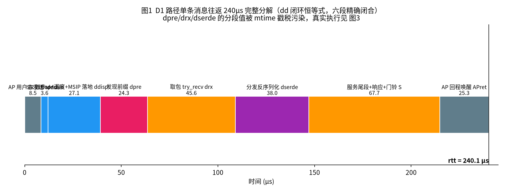
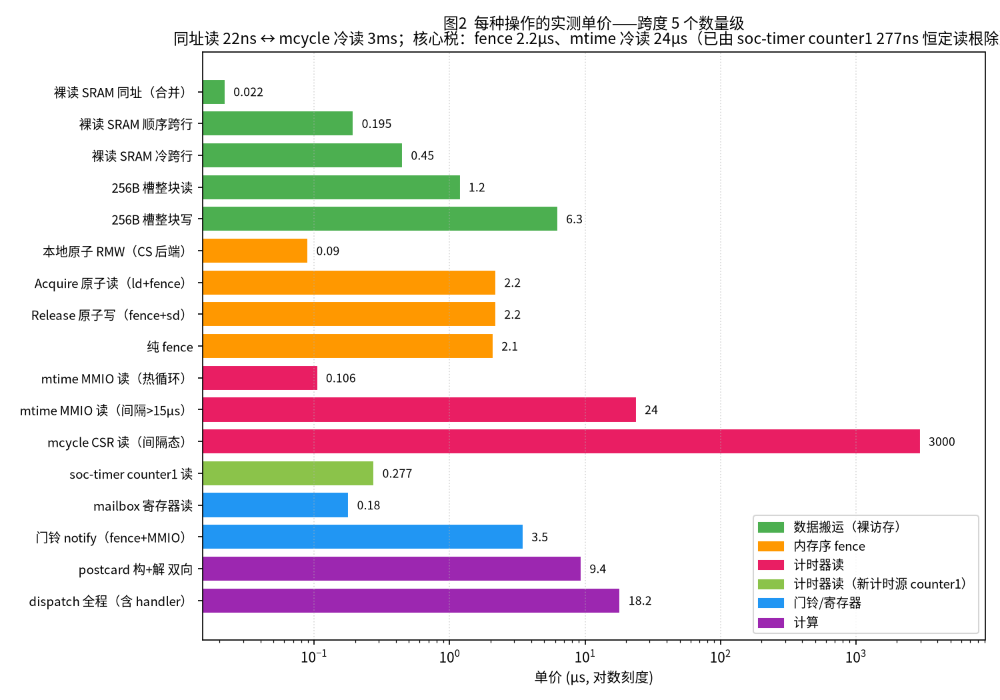
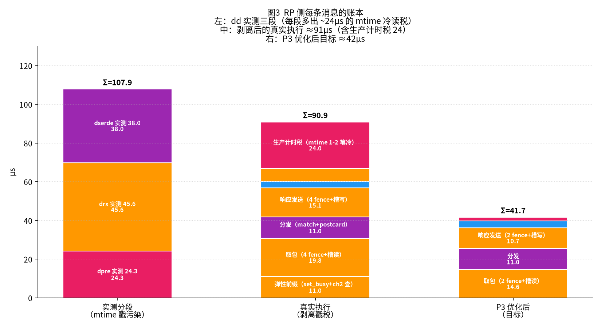
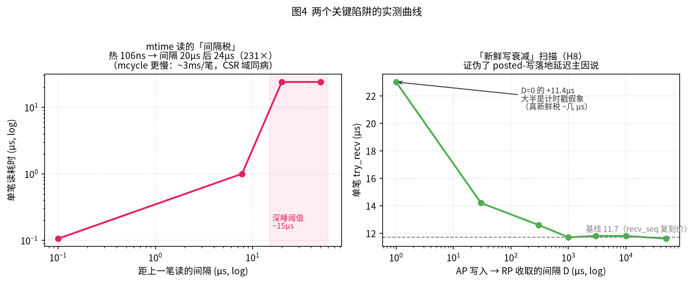
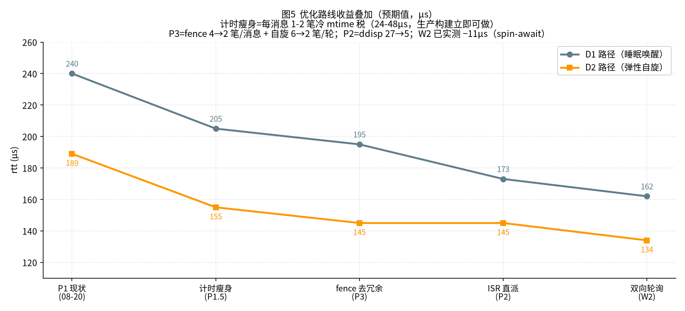

# K3 IPC 延迟归因战役总结报告

**时间跨度**：2026-08-16 → 08-21（六天，~15 轮板上测量）
**对象**：K3 COM260 真板，AP（X100 大核，StarryOS/Linux）↔ RP（RT24 小核 @~246MHz，rt-async RTOS）跨核 RPC
**现状**：单条 PING 往返 **D1（睡眠唤醒）240µs / D2（弹性自旋）189µs**（战役起点 294µs）
**本文目的**：完整说清"每一微秒消耗在哪一环、每一种指令的单价是什么、接下来怎么优化"。

> 全部数据为板上实测（dd 场景闭环残差 30/30 = 0.0，AP/RP 双钟交叉校验）。
> 图表由 `make_figs.py` 生成（`python3 make_figs.py` 重跑）。
> **维护约定**（2026-08-21 起）：本报告随进展实时维护——每次进展先形成干净的
> commit，再同步更新本报告；**本报告入 git 维护，除此之外的过程文档一律不维护**。

---

## 0. 一页总结（TL;DR）

```
240µs 的 D1 往返 =
   AP 发送 8.5  →  门铃+唤醒链 ~40  →  RP 取包+分发 ~75  →  响应+门铃 ~20
   →  AP 收到 25  →  其中 ~50µs 是"读自己计时器"和"内存序 fence"的隐形税
```

**三大发现（决定了整个优化路线）**：

| # | 发现 | 实测 | 影响 |
|---|------|------|------|
| 1 | **fence 恒定 2.2µs/条**（`ld+fence r,rw` 即 Acquire 读） | 四种口径全 2198-2222ns | 每条消息热路径 ~14 条 fence ≈ 31µs；这是**内存序的物理税**，只能靠减少笔数 |
| 2 | **mtime 计时器冷读 24µs/笔**（间隔 >15µs 后跨时钟域同步器重锁） | 热循环 106ns → 间隔 20µs 后 24.5µs（231 倍）；mcycle CSR 冷读更慢（~2.9ms；热读仅 17ns、按核频 245.84MHz 计数） | 每条消息的计时/统计链吃掉 24-48µs（生产构建）或 40-70µs（测量构建）——**既是真执行税，也污染了所有分段测量** |
| 3 | **W2 双向轮询实测 −11µs**（AP 响应方向改用户态自旋，免 syscall/内核唤醒） | rtt 189→178，零固件改动 | 路线图里最便宜的一步，已经预演成功 |

一句话：**慢的不是协议，不是数据搬运，是"付序的钱（fence）"和"付时间的钱（计时器）"**。

---

## 1. 系统与一条消息的旅程

```
┌─────────┐   写请求槽+索引       ┌──────────────┐    读槽+分发+响应
│ AP 大核  │ ──cbo发布──▶ 共享窗  │ ◀──────────  │  RP 小核 rt-async
│ Linux   │   SRAM 100KB         │   弹性自旋/IRQ │  614/491MHz RTOS
└────┬────┘                      └──────────────┘
     │  ▲ mailbox 门铃（硬件 FIFO，IRQ 3463ns/次）
     ▼  │
   AWAIT ioctl（内核睡眠等响应）
```

- **通道结构**（ov-channels SPSC 环）：ch0 请求（AP→RP）、ch1 响应（RP→AP）、ch2 急停。每通道 = magic 头 + 读写索引（同 cache line）+ 128×256B 消息槽。
- **四种发现路径**：D1 门铃唤醒（间隔 >2s）/ D2 弹性自旋命中（<2s，免门铃免 syscall）/ D3 批处理追加 / D4 竞态闭环兜底。
- X100 的共享窗映射**实际 cacheable**（PTE PBMT 不生效），跨核一致性全靠 fence/CBO 同步点——这是一切 fence 税的根源。

---

## 2. 总预算：240µs 花在哪了（图 1）



D1 路径六段（dd 场景闭环恒等式 `rtt = send + ddrain + ddisp + dseen + S + APret`，残差 0.0）：

| 段 | 含义 | 实测 µs | 内部构成 |
|---|------|-------|---------|
| send | AP 用户态写入+发布 | 8.5 | user-cbo 按行发布（槽 4 行+索引 1 行）+ BUSY 判定，D2 路径零 syscall |
| ddrain | RP ISR 舞步 | 3.6 | mailbox FIFO 排空 + latch（①′优化后从 11.3 降来） |
| ddisp | trap+调度+MSIP 落地 | 27.1 | 含 MSIP 跨桥写落地 ~54µs 物理地板的摊派 + 执行器派发（ISR 直派已否决——处理留 task 上下文，此段为 rt-async 任务模型的结构性成本） |
| dpre | 发现前缀 | 24.3 | set_busy(2.2) + ch2 空查(6.6) + **mtime 戳税(~14)** + 链路 |
| drx | try_recv 取包 | 45.6 | 3 笔 Acquire(6.6) + 槽读(1.2) + Release(2.2) + **mtime 戳税(~24)** ≈ 真实 ~20 |
| dserde | 分发+反序列化 | 38.0 | method_id(1.1) + dispatch/postcard(~10) + **mtime 戳税(~24)** ≈ 真实 ~11 |
| S | 服务尾+响应+回程门铃 | 67.7 | handler 余下 + 响应 try_send(16.6) + notify(3.4) + AP 内核唤醒 Y≈54(物理地板) |
| APret | AP 唤醒回收 | 25.3 | IRQ→调度→用户态→读响应 |

**注意**：dpre/drx/dserde 是"含计时戳税的测量值"——剥离后 RP 真实执行见 §4 图 3。
**D2 路径**（189µs）：send 8.8 + 自旋发现（半周期 ~9µs）+ RP 真实处理 ~70-90 + AP 收尾——同样的 RP 账本，只是唤醒链换成了轮询粒度。

---

## 3. 每种指令的实测单价（图 2）



### 3.1 数据搬运（裸访存，无内存序）——都很便宜

| 操作 | 单价 | 说明 |
|------|------|------|
| 裸读 SRAM 同址 | 22ns | 前端合并效应（连续读同地址被合并） |
| 裸读 SRAM 顺序跨行 | 195ns | 流水后 |
| 裸读 SRAM 冷跨行（512B 步进） | 417-520ns | 无流水 |
| **256B 消息槽整块读** | **1.2µs** | try_recv 的取包成本 |
| **256B 消息槽整块写** | **6.3µs** | 写穿无合并（send_seq 推出）——写比读贵 5 倍 |
| mailbox 寄存器读 | 148-196ns | 主域窗口 148 / 本地窗口 180 |

### 3.2 内存序（fence）——核心税 #1

| 操作 | 单价 | 生成物 |
|------|------|--------|
| Acquire 原子读 | **2198ns** | `ld` + `fence r,rw`（从来不是原子指令！） |
| Release 原子写 | **2222ns** | `fence rw,w` + `sd` |
| 纯 fence | ~2095ns | 四变体（r,rw / rw,w / rw,rw / iorw,iorw）全同价 |
| 本地原子 RMW（P1 CS 后端） | **~90ns** | `csrrci mstatus,8` + 普通 ld/sd，P1 战果 |

**规律**：fence 与冷热、地址、目标（SHM/本地 .bss）**全部无关**，恒定 2.1-2.2µs。RP 对窗口无缓存（读到即真值），但免 fence 的纯读会被前端合并缓冲**钉死陈旧值**（litmus L1：0/200 新鲜）——所以跨核读必须付 fence，没有免费刷新原语（邻址读、CBO 替代均无效/未证）。

### 3.3 计时器——核心税 #2（本次战役最大意外）

| 操作 | 单价 | 说明 |
|------|------|------|
| mtime MMIO 读（热循环） | 106ns | 背靠背流水价 |
| **mtime MMIO 读（非背靠背）** | **~24.5µs** | 跨时钟域同步器重锁，231 倍；**任意非背靠背间隔触发**（poll 间隔几十 ns 亦冷——now_gapped 每轮 69µs，见 §6 附记） |
| mcycle CSR 读（热） | **17ns** | 4 cycle/笔（cycle_hot 4158c/千笔），CSR 本地读无 MMIO |
| mcycle CSR 读（间隔 ~400µs） | **~2.9ms** | 冷读税比 mtime 重 118 倍；但计数为**核频 245.84MHz**（cycle_cal 联标 1,229,222c/5ms，非 mtime 同源）——"仅冷读慢"型：stamp 链段间保温可用（保温笔仅 17ns），生产每消息级间隔计时冷读不可用 |
| **soc-timer counter1（0xd4016094）** | 背靠背 277ns；**间隔读 ~13µs** | AP 域 APB 块，12.8MHz 自由运行（mux=0）。换源方案**板上证伪**（08-22）：277ns 是流水价，真实路径 mark 间隔 µs 级仍触发 ~13µs 重锁税（跨域同病、仅轻于 mtime 的 24.5µs），整链 8 笔净亏（rtt 240→248.5 实证）；驱动已删（dfb8b5e，timer_k3 改道本地域） |
| **AON_TIMER1（0xc0889000，本地域）** | 背靠背 **4ns**；纯本地间隔读 **~1.9µs**；**生产路径间隔读 ~10µs 级** | RCPU AON 域专属（06_address_map §6.2）。板上验证（08-22）：计数递增、实测 **2.0001MHz**（文档标称 SEL=0=25.6MHz 与实况不符）。**生产迁移二度证伪回滚（05691b0）**：rtt 240→251.5 反向，各段与 counter1 轮同形——探针税（纯本地 spin 间隔）≠ 生产税（跨域流量填充间隔），见 §6 |

**推论**：每条消息的计时/统计链（step 计时、SVC 统计、弹性窗计时、测量构建的 stamp 链）里有若干笔"间隔上百 ms 的冷读"——**每笔真等 24µs**。测量构建（probe 开）每消息 6-8 笔（40-70µs 税）；**生产构建（probe 关）只剩 step/SVC 计时 2-4 笔（24-48µs 税）**。

### 3.4 门铃/中断与计算

| 操作 | 单价 |
|------|------|
| 门铃 notify（fence + mailbox MMIO 写） | 3.46µs |
| postcard 构+解双向（PING 形状） | 9.4µs |
| dispatch 全程（宏 match+反序列化+handler+响应构造） | 18.2µs（op 内热价） |
| MSIP 跨桥写落地 | ~54µs（物理地板，rtbench sec8 定案） |

---

## 4. RP 侧每条消息的逐笔账本（图 3）



**左柱：测量构建的实测三段（108µs）**——每段混入段边界那笔 mtime 冷读（~24µs/笔）。
**中柱：剥离后的真实执行（~91µs）**，逐笔账：

| 环节 | 操作序列 | 笔数 | 小计 |
|------|---------|------|------|
| 弹性前缀 | set_busy(Release 2.2) + ch2 空查(3×Acquire 6.6) + 链路 | 4 fence | ~11µs |
| **取包 try_recv** | magic Acq + read Acq + write Acq + 槽读 1.2 + read Rel | **4 fence + 1 块读** | **~20µs** |
| 分发 | method_id + 宏 match + postcard 反序列化 | 纯计算 | ~11µs |
| **响应 try_send** | magic Acq + write Acq + read Acq + 槽写 6.3 + write Rel | **4 fence + 1 块写** | **~15µs** |
| 回门铃 | notify = fence + MMIO 写 | 1 | 3.4µs |
| 收尾 ch2 再查 | 3×Acquire | 3 fence | 6.6µs |
| 生产计时税 | step/SVC 计时 1-2 笔冷 mtime | 1-2 | ~24µs |
| **合计** | | **~14 fence** | **~91µs** |

其中**结构性冗余**（P3 的靶子）：magic 每次都查（运行期不变）、read/write 索引里有一半是"自产数据"（RP 是唯一写者，免 fence 即新鲜）、ch2 前后两次全量查。

**右柱：P3 优化后目标（~42µs）**：magic 缓存（validate 一次）、自产索引 Relaxed 化、自旋/检查从 6 笔 fence 降到 2 笔、计时改采样制。

---

## 5. 侦探故事：九个假设与一个真凶（图 4）



32µs 级缺口（探针合计解释不了的 drx/dserde 超额）排查了九个假设：

| 假设 | 判定实验 | 结果 |
|------|---------|------|
| H1 fence 冷热单价差异 | aq 四口径（同址热/跨址/间隔/本地） | ✗ 全部 2198-2215ns |
| H2 postcard 反序列化慢 | postcard_rt | ✗ 双向才 9.4µs |
| H4 WFI 冷核执行惩罚 | dd 100ms 间隔（D2 热态） | ✗ svc/drx 与 D1 冷态同价 |
| H5 真实通道地址溢价 | self_round（真实 ch0 自往返） | ✗ = scratch 复刻之和（差 1%） |
| H7 冷取指/冷执行 | dd warm_gap（测量前 300µs 预热同路径） | ✗ drx 43.7 纹丝不动 |
| H8 新鲜写落地延迟 | fresh 衰减扫描（D: 0→50ms） | ✗ 仅 11.4µs@D=0 且大半是戳假象 |
| H9 AP 内核活动竞争 | spin-await（AP 零 syscall 零调度） | ✗ drx 仍 43.5；**附产物：W2 实测 −11µs** |
| **终案：mtime 冷读** | **now_gapped** | ✓ 间隔 20µs 单笔 24.5µs，同时解释 dslot 37.2（=槽读 12+戳 24）/ drest 34.0（=dispatch 10+戳 24）/ didx 7.8 干净（间隔 8µs 未过阈值）的全部对称性 |

讲解动线：*"同一操作，探针 11.7µs、真实路径 43.6µs、预热也不降、AP 睡死也不降——那慢的必然在 RP 内部且与'相邻两次计时器的间隔'有关。now_gapped 一锤定音。"*

**附：战役意外修出的三个潜伏 bug**（详见附录 A）：槽区布局偏移错 0xF0（sizeof 断言无法区分）、AP 按行刷新错位（靠内核兜底而虚标）、`csrr cycle` 在 M 态未实现（Illegal Instruction）。

---

## 6. 优化路线图（图 5）



| 优先级 | 项 | 内容 | 预期收益 | 工作量/风险 |
|-------|----|------|---------|------------|
| ✅ 已完成 | P1 | 单核原子 CS 后端（atomic-cas:false target）+ timer 直连 + 本地别名窗 + mailbox 去 Acquire | 294→240（D1）/ 209→189（D2） | 已合入 |
| ❌ 已证伪 | ~~计时瘦身·换源~~ | **两度板上证伪并回滚**（counter1：6f4ec9d；AON_TIMER1：05691b0）。**根因定性（08-22 AON 轮定案）：mtime 的 24.5µs 冷读税在生产路径从未被支付**——stamp 点前后交织的 SHM/fence 流量把 mtime 路径保温，基线无税可省；替换计时器（无论域别）在真实间隔下读仍付 ~10µs 级（探针税≠生产税）。计时链维持 mtime；剩余可行项 = **减 mark 笔数**（探针/统计降频），收益重新评估 | 重新评估（原 −40~90µs 前提不成立） | — |
| **已实施待验收** | **P3 fence 去冗余** | **已落地（ov-channels b45bc0a + 主仓 bd662e7，08-22）**：magic → Relaxed（运行期不变量）+ 自产索引 → Relaxed（SPSC 单写者：try_send 的 write / try_recv·peek·has_pending·is_empty·len 的 read）；**对端索引 Acquire 与发布 Release 原样保留——数据可见性协议零妥协**。try_recv 3→1 笔 Acquire、try_send 3→1、自旋轮（ch0+ch2 has_pending）6→2 笔。QEMU 冒烟通过 | **−9~10µs/消息 + 自旋 18→6µs/轮**（待板上同启动 A/B 验收） | 已完成 / 待验收 |
| 第 3 刀 | **W2 双向轮询** | AP 响应方向用户态自旋（已实测 −11µs）；绕过 MSIP 54µs 物理地板 | −11µs 起；延迟关键模式更多 | 小（bench 已预演）/ 烧 AP 核 |
| ❌ 已否决 | ~~P2 ISR 直派~~ | ~~响应在 ISR 内写完~~ **否决（2026-08-21）**：不破坏 rt-async 的任务模型——实际处理必须留在 task 上下文（executor/waker 语义），ISR 只做唤醒/标记；ddisp 27.1µs 作为结构性成本保留 | —（预期 −22µs 放弃） | — |
| 远期 | 硬件 | mailbox 载荷直传小消息（数据进门铃）/ 硬件 spinlock（0xCAC9_1C00，手册背书） | 再往下 | 大 |

叠加预期（不含已否决项）：**D1 240→~184，D2 189→~134**。再往下就是 SPSC 协议本体（每消息 4 笔 fence ≈ 8.8µs）+ 数据搬运（~7.5µs）+ 任务模型结构性成本（ddisp ~27µs）的物理下限区。

**本地域优先原则（2026-08-22 定案，后续所有外设选型遵守）**：RT24 高延迟访问的根因是**跨簇间互连**——mtime（SysTimer @0xe4000000）虽是 rcpu1 功能上的计时器（mtimecmp 按 hart<<27 分区服务全部 hart），但物理上是全 SoC 共享块，挂在簇间互连上，读它必出远门（24.5µs 间隔重锁税即互连/桥的空闲路径唤醒，热读 106ns 证明路径本身不慢；机制无文档，未解项）。**RT24 本地总线上的外设只有 0xc088_xxxx AON 域这批**（06_address_map §6.2：AON_TIMER1~4、mailbox、PWM 等）。凡是高频访问的外设（计时、自旋索引），尽可能以本地域替代外域——这是 AON_TIMER1 换源尝试（dfb8b5e）与远期硬件选项筛选的共同准则。附带收获：**2026-08-21 "rtimer0 块死"悬案破案**——非域过滤，是 `MCU_TIMER1_CLK_RST`（0xc088c04c）bit0 TIMER_SW_RSTN **低有效**（复位值 0=保持复位），当时按 APBC 高有效惯例写两笔 0x7→0x3，第二笔清了 bit0 把外设重新按住复位。

**本地域换源：探针达标 → 迁移 → 回滚，三轮同形定案（08-22 完整弧线）**：tmr_rt_on 计数递增（Δ=2002/ms）破"块死"旧案；tmr_aon_cal 联标 **2.0001MHz**（文档 SEL=0 标称 25.6MHz 与实况不符）；热读 **4ns/笔**（全系统最快）；纯本地间隔读税 **~1.9µs**（tmr_aon_gapped wall−Σaon）。据此迁移（eb2da18，含 counter1 轮 t_seen 漏迁教训的全量同钟核查，闭环残差 0.0）——dd 复测 rtt 251.5，当时归因"迁移反向"；**回滚复测（mtime 版固件）rtt 仍 ~249，与 counter1 轮（248.5）/AON 轮（251.5）三轮统计同形 ⇒ 修正定案：+11µs 全部为启动间环境态**（send 8.5→14.4 三轮恒定佐证；基线 240 是另一启动环境），**计时源在生产路径是中性的**——mtime 24.5µs 冷读税在真实路径被交织流量保温从未支付（无税可省），替换计时器也无额外代价，换不换都一样。**换源线关闭**（无收益也无损失）；timer_k3 驱动与 tmr_aon_* 探针保留（AON_TIMER1 本身是真发现：活本地域 2MHz 计数器，短间隔测量备用）。**探针税 ≠ 生产税**规则维持——探针只作筛选，优化验收只认生产 dd。环境态悬案：send +6 与 RP 段 +5 随启动漂移（同启动内极稳，σ=0.16µs），疑热态/频率/固件加载地址类因素，非本轮可控——**此后所有 dd 对比以同一次启动内的 A/B 为准**。

**计时源替换：换源证伪与回滚**（08-21 判可行 → 08-22 板上证伪，完整记录）：`tmr_clkon` 开门成功、counter1 @12.798MHz 自由运行、`tmr_cal`/`tmr_setup` 全绿——但迁移后复测 **rtt 240.0→248.5µs 反向**。归因：`tmr_hot` 277ns 是**背靠背流水价**，真实路径 stamp 间隔 µs 级时每笔 **~13µs 重锁税**（dslot 40.4/dpre 25.8/svc 146 反推一致；12.8MHz 计数钟到 RCPU 总线同样跨时钟域，病轻于 mtime 但整链 8 笔净亏）；`tmr_gapped` 的负 Δ 被"异设备读令 mtime 变热"效应掩盖——探针结构盲区教训。**已回滚（6f4ec9d）**，counter1 驱动已删（dfb8b5e，timer_k3 重写为本地域 AON_TIMER1）。结论固化：**三个外域计时器（mtime/counter1/mcycle）间隔读全部有跨域税（24.5/13/2900µs）**——换源能否复活取决于本地域 AON_TIMER1 的 tmr_aon_gapped 实测；不行则计时瘦身唯一出路 = 少读（采样制/减 mark）。另：本轮 dd 的 send 14.3 vs 之前 8.5µs（AP 侧路径未改，未解，待下轮确认是否环境漂移）。

**附记（mtime 税模型再修正）**：now_gapped 69µs/轮（t0 + 首笔 poll 都吃 24.5µs 冷价）证明 **mtime 冷读由"任意非背靠背间隔"触发**（poll 间隔几十 ns 亦冷）；而 tmr_gapped 在 t1 前插入一笔异设备读（counter1 277ns）后每轮仅 22.4µs——mtime 读全部变热。机制未解（流水线/前端行为），不影响"去 mtime"决策；好奇心探针留给后续。

**mcycle 三面定案**（2026-08-21 板上）：热读 **17ns**/笔（4 cycle，CSR 本地）、频率 **245.84MHz = 核频**（≈491.52/2，与总线探测 SEL=0 吻合；此前"与 mtime 同源 24MHz"证伪）、间隔读 **~2.9ms**/笔（比 mtime 重 118 倍）——**"仅冷读慢"型**：测量 stamp 链可迁 mcycle + 段间保温（保温笔 17ns 可忽略，段间隔 >15µs 处补一笔空读）；**生产每消息级间隔计时不可用冷读**，仍赖 soc-timer counter1（待测）或采样制。

---

## 7. 测量方法与可信度

- **dd 场景**：AP 双钟戳（内核 RD_KTS）× RP mtime 戳交叉，钟差无关恒等式（S 与 AP 回程），闭环残差 30/30 = 0.0。
- **mb 场景**：MEMBENCH RPC 35 个微基准 op，热循环 + 间隔变体 + 真实通道自往返。
- **litmus L1/L2/L3**：免 fence 顺序性的正反对照实验，全绿。
- **已知测量坑**（本文已修正/标注）：mtime 戳税污染分段、T_SCHED 连续流不刷新（D2 下 dpre/dseen 失效）、fresh_scan 列错位、判读 g() 索引差一。
- **未修已知问题**：AP 侧退出段错误（0xffffff00 前缀 EXECUTE，信号相关时刻）；SIGALRM 打不断内核 AWAIT；mcycle 已定案（热 17ns/核频 245.84MHz/冷 ~2.9ms）。

## 8. 数据溯源

| 数据 | 场景/轮次 | 关键值 |
|------|----------|--------|
| P1 后 D1 分解 | dd 30 轮（08-20） | rtt 240.0 / drx 45.6 / dserde 38.0 / svc 130-135 |
| D2 热态 | dd 100ms 间隔 ×3 轮 | drx 43.5±0.4 / dserde 34.4 / svc 130.8 |
| 细分四段 | dd + stamps 6 槽（08-21） | didx 7.8 / dslot 37.2 / dmth 1.1 / drest 34.0 |
| 单价表 | mb（08-20/21 两轮复现） | 全部 ±1% 复现 |
| H8 衰减 | mb fresh_scan（修列错位后） | 23.0→11.6µs |
| mtime 定案 | mb now_gapped | 每轮 69µs = 20µs 忙等 + 2×24.5µs 冷读 |
| mcycle 三面定案 | mb cycle_hot/cycle_cal/cycle_gapped（08-21） | 热 4158c/千笔=17ns；245.84MHz（核频）；间隔读 ~2.9ms/笔（每轮 wall 6.18ms − 忙等 393µs = 2 笔） |
| soc-timer 判死 | mb tmr_setup/gapped/cal/b_scan（08-21） | CER 写不粘（cer=0 / retries=8）；counter1 5ms 0 ticks；热读 277ns/笔；d4014000 全零 |
| mtime 模型修正 | mb now_gapped vs tmr_gapped | 69µs vs 22.4µs/轮——t1 前插入一笔异设备读（277ns）使 mtime 全热（机制待查） |
| W2 预演 | BENCH_SPIN_AWAIT=1 dd | rtt p50 178.1（σ4.1） |

## 附录 A：战役意外修出的三个潜伏 bug（+1 在查）

1. **槽区布局偏移错 0xF0**：`Message` 是 `align(256)`，`RingBuffer.buffer` 垫到 +0x100 而非朴素假设的 +0x10；sizeof 断言对两种布局同取整（0x8100）无法区分。修复：`ov_channels::RB_SLOTS_OFF` 作为布局唯一真相源 + host 回归单测。
2. **AP 按行缓存刷新错位**（user-cbo `refresh_slot` 用了错的 SLOTS_OFF）：错位 0xF0 期间全靠内核 AWAIT 的 invalidate 兜底——"按行精确刷新"的优化贡献此前虚标。随 1 一并修复。
3. **`csrr cycle` 在 M 态未实现**：用户态别名 CSR 触发 Illegal Instruction 打挂固件；改用 `mcycle`（0xB00）。
4. **定案（08-21 夜）：fresh_scan D=100µs dummy 不可见 = user-cbo `cbo.flush` 静默丢失**（三轮确定性复现）。决定性数据：超时时 **AP 缓存视角发布后 (r=118, w=120)，SRAM/RP 视角 200ms 仍 (119,119)**——AP 的索引行 flush 未把新 write 值写回 SRAM（若写回即使带陈旧 r，RP 也会看到 w=120 出队）。非"同行回卷"分支。**user-cbo 发布链的真实正确性缺口**：publish（fence → cbo.flush → fence）在 X100 U 态存在静默丢失窗口（疑 store 尚在写缓冲时 flush 按行 clean 到的是旧行）。缓解方向：publish_send 后 refresh+回读校验 w，失败重试 flush（或退化内核整窗 clean）；待实施。
